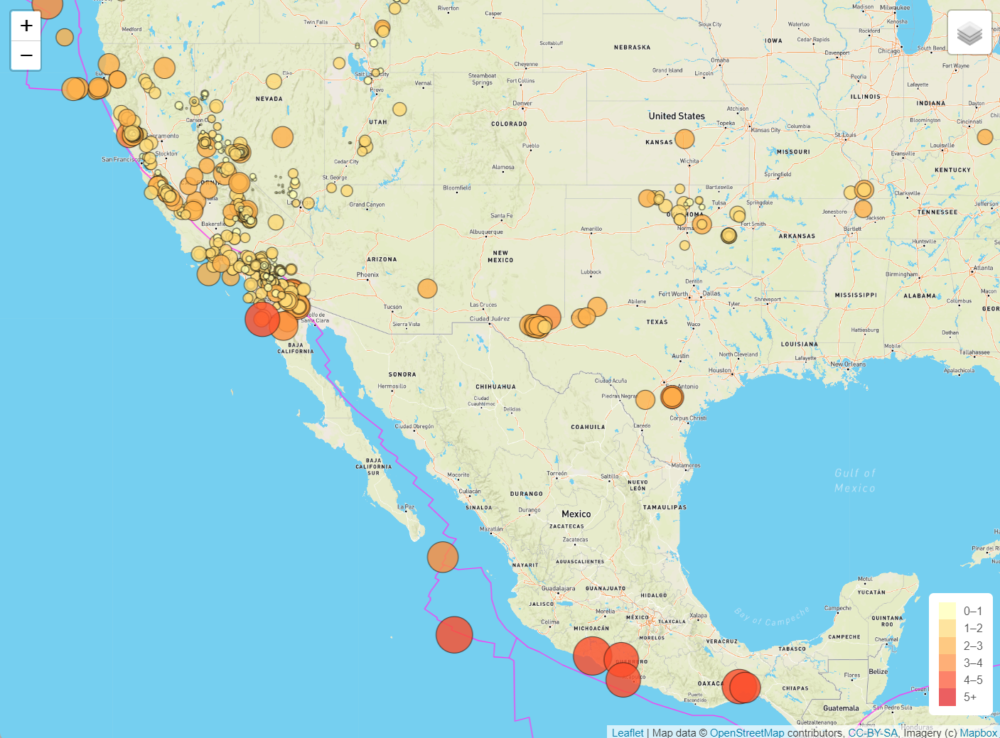

# Mapping Earthquakes

This project utilizes d3, leaflet and mapbox CDNs to format and display geological data from geoJSON streams. I used this an exploration of leaflet and the geoJSON data format but the major goal of this project was to create a format that shows the last 7 days of earthquake data in an accessable form.

Methods and Resources
---

 My JavaScript file parses geoJSON data from <a href="https://earthquake.usgs.gov/earthquakes/feed/v1.0/summary/all_week.geojson">earthquake.usgs.gov</a>, adding circles with radii and colors that correspond to the magnitude of each earthquake at the location associated.

 In order to get the tectonic plate lines I borrowed data from github user <a href="https://github.com/fraxen/tectonicplates">fraxen</a>'s collection of plate boundary geoJSON data.

